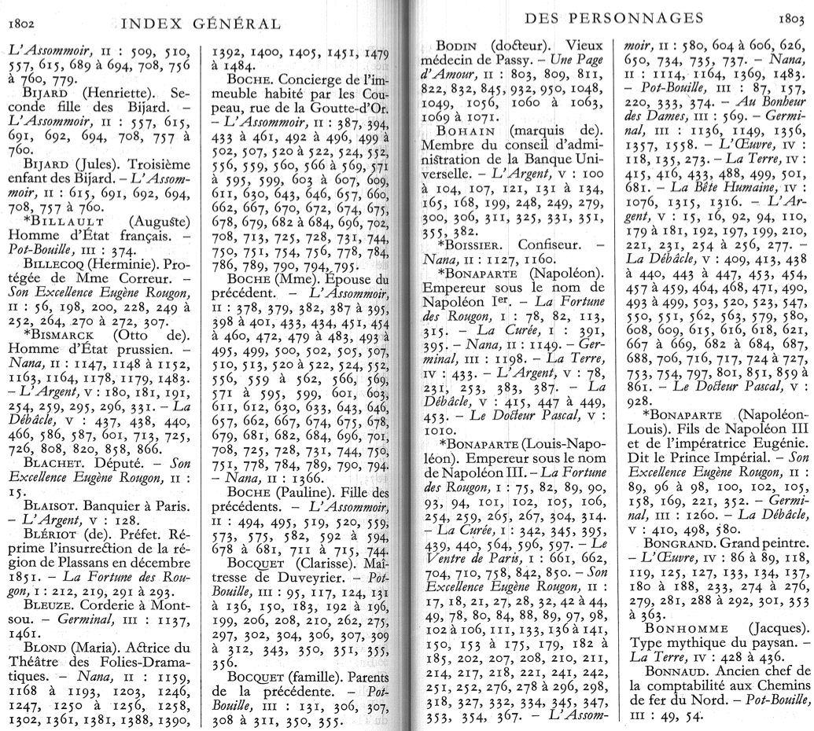
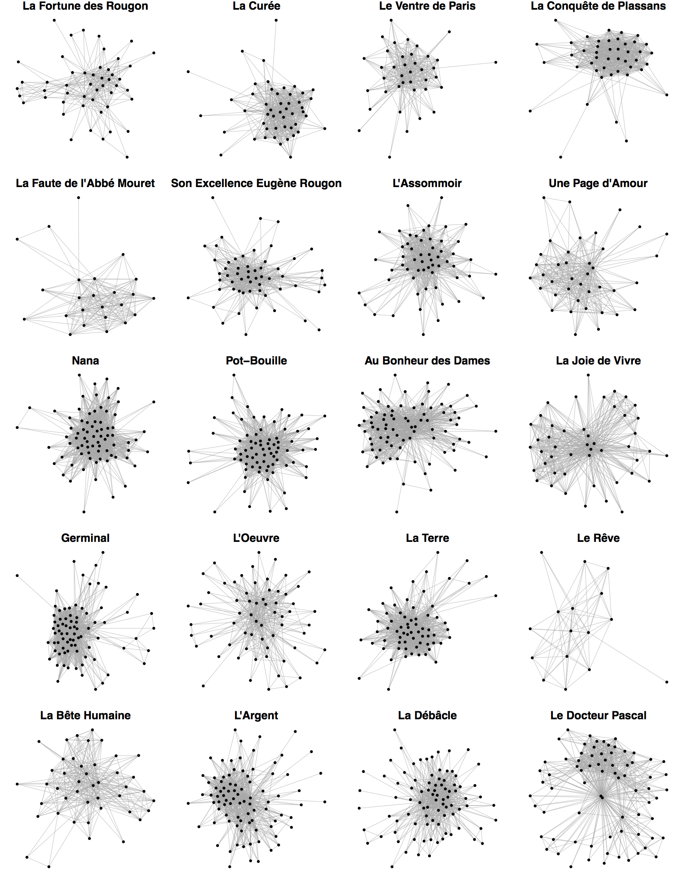

This dataset was used for a [conference paper at the Digital Humanities 2015 conference in Sydney](https://serval.unil.ch/fr/notice/serval:BIB_E4427AF55A80).

The networks were built with [the method of co-occurrences developed in my PhD thesis](../../../phd_thesis) (2014). I used R and [igraph](../../../../igraph/rigraph/).

This dataset contains:

* The index of character occurrences in the 20 novels (La Pléiade edition)
* 20 character networks based on the novels composing Émile Zola's Les Rougon-Macquart, written between 1870 and 1893

The (undirected) character networks are available as csv files, with three columns: the third column is for the weights (see the [PhD thesis](https://serval.unil.ch/fr/notice/serval:BIB_663137B68131) for more explanations about the computation).

The index of characters is available at the end of La Pléiade edition of Les Rougon-Macquart. It was digitised and corrected so that names are recognisable. Some errors remain, but it doesn't have an impact on the data.

Example of original data:

If you analyse the networks (reminder: never base any conclusion on network plots!), you will see that they had their characters organised differently from one novel to the next, whereas they were written by the same author.

